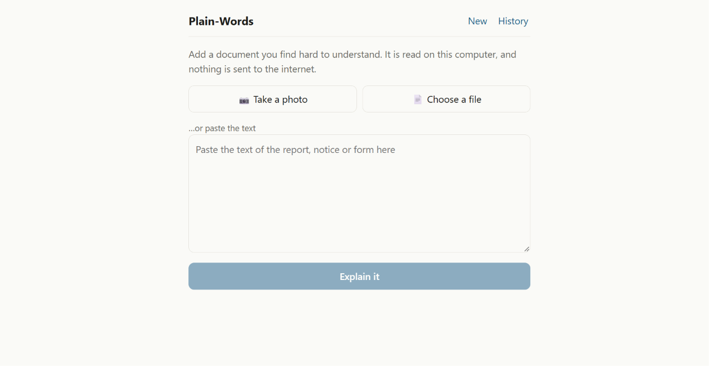
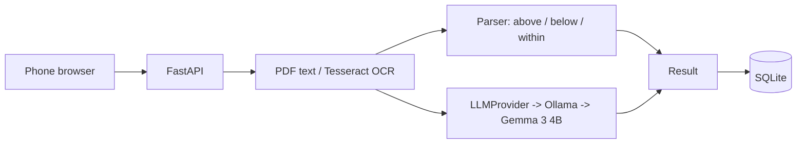

# Plain-Words

A small tool that turns a confusing document (so far: lab reports) into a plain-language explanation in English and Hindi. It runs entirely on a laptop with a local open-weight model. Nothing is sent to the internet.

I built it over a weekend for my college friend Bhavya Gothi, for the Hacktoberfest 2026 DEV "Build for a Friend" challenge. Bhavya's problem, in their words: for medical paperwork they ask the family doctor, and for everything else they upload it to Google and try to understand it, which is very stressful.



## What it does

- Take a photo of a document, upload a PDF or .txt, or paste text.
- Gives a summary, key points, a glossary of the hard words and "things to ask your doctor".
- Switch the result to Hindi.
- Saves a history on your own machine, with a delete button.

## The part I care about most

A 4B model on a CPU should not be trusted to compare numbers. In an early test it said an HbA1c of 6.8% was "within the reference range" on a report that flagged it high, and it failed the same way on repeat runs. So the app doesn't ask it to. Plain code parses each result and its printed reference range and decides above / below / within. The model only writes the glossary. If the document has no numbers (a notice, a form), the model writes the summary.

The glossary meanings are the model's general knowledge, not facts from your document, so they can be wrong or badly translated. Each term's quoted line is checked against the document, which proves the quote exists but not that the meaning is right.

## Stack

React + Vite → FastAPI → explain service → Ollama (`gemma3:4b`) → SQLite. OCR is Tesseract.



All model calls go through one `LLMProvider` interface (`backend/app/llm`). Switching models is a one-line change to `LLM_MODEL` in `.env`.

## The model

- Default: `gemma3:4b` via Ollama, on CPU. It was the better of two I tried at Hindi.
- Qwen 2.5 3B was faster but its Hindi in my test was unusable.
- License: Gemma is released under the **Gemma Terms of Use**, which is Google's own license, not an OSI-approved one. So I call it "open-weight", not "open-source". Read the terms before using it for anything beyond this project.
- My code is MIT. The model keeps its own license.

## Run it (Windows)

Needs Python 3.12, Node, Ollama and Tesseract (with `eng`, optionally `hin`).

```bat
ollama pull gemma3:4b

cd backend
python -m venv .venv
.venv\Scripts\activate
pip install -r requirements.txt
copy .env.example .env
uvicorn app.main:app --host 127.0.0.1 --port 8000
```

In a second terminal:

```bat
cd frontend
npm install
npm run dev
```

Open http://localhost:5173. To use it from a phone, join the same Wi-Fi and open `http://<laptop-ip>:5173`. I only tested on Windows 11.

## Tests

```bat
cd backend
python -m pytest -q
```

10 tests: the range parser, the Hindi templates and the API round trip (with a fake model, so they need no Ollama). Photos, real model output and Hindi quality were checked by hand.

## Limits (honestly)

- CPU only: roughly 35 s to explain and 20 s for Hindi on my i5-13420H, more for photos.
- The range parser handles two line formats. Reports laid out differently get the model-only path, which is less reliable.
- OCR can misread blurry numbers. The app shows the text it read so you can compare it with the paper.
- Tested by one person, on one sample report (fictional data in `samples/`).
- Not medical, legal or financial advice. It explains what a document says. It does not diagnose and does not know your situation.

## Friend testing

---
title: "Plain-Words: a lab-report explainer that runs on my laptop, built for a friend"
published: false
tags: devchallenge, weekendchallenge, hf26challenge
---

Bhavya is in my class. I asked what happens when a confusing document lands in their family, and the answer was simple. If it's medical, they ask the family doctor. If it's anything else, they upload it to Google and try to work it out themselves, which they described as very stressful. They wanted a way to read and understand important documents that was easier, less stressful and less time-consuming.

So over a weekend I built Plain-Words. You give it a photo, PDF or pasted text of a document, and it gives back a plain-language summary, a glossary of the hard words and a few things worth asking a doctor about. It can switch to Hindi, because that's what an older relative might actually read.

It runs entirely on my laptop. Nothing leaves it.

## What it does

You take a photo of a lab report, or upload a file. About a minute later you get:

- a short summary of which results fall outside the range printed on the report
- one key point per result, tagged "Above listed range" or "Within listed range"
- a glossary of the terms and units
- specific questions to ask a doctor
- all of it again in Hindi

There's also a history with a delete button, and a thumbs up/down on every explanation.

## Demo


The report in the screenshot is a fictional one I wrote for testing. No real patient data is in the repo or in this post.

## How it works

The front end is React and Vite. Behind it is FastAPI, with Tesseract for photos, SQLite for history and a local model through Ollama. Every model call goes through a small `LLMProvider` interface, so changing the model is a one-line edit in `.env`.

The design decision that matters most is what the model is not allowed to do.

My first attempts simply asked Gemma to explain a sample HbA1c report. It told me 6.8% was "within the reference range" on a report that flagged it high, and in a bare prompt it drifted into diet advice. Running the same prompt again gave different answers. A small model on a CPU is not a reliable number comparer.

So the app doesn't ask it to. A parser reads each result and the reference range printed next to it, and plain code decides above, below or within. That output becomes the summary, the key points and the doctor questions, with no model involved. The model only writes the glossary. For documents with no numbers, like a notice or a form, the model writes the summary instead. That path is less reliable, and I haven't tested it much.

Each glossary entry quotes a line from the document, and the code checks that the line really appears there. That proves the quote exists, not that the explanation is right. The meanings are the model's general knowledge and can be wrong.

## The AI behind it

I used Gemma 3 4B through Ollama, on the CPU. I'd planned around having a GPU, but the laptop I built this on has only Intel UHD graphics (i5-13420H, 16 GB RAM). The 4B model at 4-bit quantization still ran at about 12.7 tokens per second, which is slow but usable.

I compared it with Qwen 2.5 3B, which was a bit faster at about 15.9 tokens per second. Its Hindi was gibberish. It talked about an injection and "five to ten months" for a blood sugar value that had neither in it. For a tool that's supposed to calm someone down, that settled it, and I kept Gemma.

On licensing: Gemma comes under Google's own Gemma Terms of Use, not a standard open-source license, so I call it open-weight rather than open-source. My code is MIT.

## Why open mattered

- **Privacy.** A lab report is the kind of document I'd hesitate to paste into a cloud service. Here the photo, the extracted text and the history stay on one machine.
- **Cost.** No API bill and no account. A student laptop is enough.
- **Picking the model.** I could put two models side by side on the same task and choose the one that handled Hindi. With a closed API I'd have gotten whatever it gave me.
- **Working around the weaknesses.** The model is local and swappable, so I could design around what it gets wrong instead of waiting for a better version.

## Building it, and what broke

- After I added the guardrails, a full run took 262 seconds. I'd made the model write a summary, key points and doctor questions, then replaced all of it with code anyway. Leaving only the glossary to the model brought it down to about 35 seconds. The Hindi step fell from 52 to about 19 seconds for the same reason.
- Gemma sometimes fell into a repetition loop while writing JSON, and Ollama killed the request with a "token repeat limit reached" error. I capped the output length and retry when that happens.
- The Hindi for the computed sentences kept coming back in English. I stopped fighting it and wrote fixed Hindi templates for those parts. I'm not a Hindi reviewer, so Bhavya checked the result.
- One translated glossary entry about fasting glucose contradicted itself, saying "after eating" and "after not eating for 8 hours". The 8 hours wasn't in the report at all. I tightened the prompt against adding numbers, but it's still a known limit.
- At one point my test script looked dead. It was just silent for over a minute, so I added a heartbeat line. Bhavya ran into the same thing in the app later.

There are 10 automated tests: the range parser, the Hindi templates and the API round trip with a fake model. I checked the photo path, the real model output and the Hindi quality by hand.

## Testing it with Bhavya

Bhavya tried it on an Android phone over Wi-Fi, using the sample report (fictional data, not a real one), and took a photo with the in-app camera. What follows is paraphrased from their written feedback, which they cleaned up afterwards, so none of it is a direct quote:

- It worked. The OCR read most of the text, though a couple of numbers and formatting spots were harder.
- They waited and wondered whether it was still processing, because it takes a while.
- They found the result much easier to understand than the original report.
- The Hindi sounded natural rather than word-for-word, and they said leaving some medical words in English was fine. They thought it would help parents and grandparents.
- They had to ask what the "ask your doctor" lines meant, and I explained they weren't a diagnosis. At first they also weren't sure whether the numbers were normal or abnormal until they read below.
- They'd use it again for blood-test reports, prescriptions and relatives' documents, to get the meaning without looking up every word.
- They suggested a clearer progress state, and said to keep the warning to check the original document.

This is one tester and one sample document, so I wouldn't call it validation.

## What changed after that

- **Progress.** A spinner with a plain "still working, not frozen" message, plus a note that photos take longer.
- **Status.** Each result now has a badge, "Above listed range" or "Within listed range", instead of relying on color alone.
- **The doctor lines.** A one-sentence note under that heading saying they're not a diagnosis, just things worth talking to a doctor about. It's in Hindi too.
- **Photo mistakes.** After a photo, a panel shows the exact text that was read, with a note to compare it against the paper.


## What I learned

Pointing a small model at a problem and trusting the answer is a bad idea when the answer contains numbers. Let the model handle language and let code handle comparisons. I also underestimated the wait. I measured it, and Bhavya felt it.

## What's next

Document types beyond lab reports, a parser that handles more layouts, a staged progress bar (reading, then explaining), a Hindi review by more native readers, and testing with real, redacted documents.

## Code

https://github.com/Rehan1604/plain-words

It's MIT-licensed. The Gemma model keeps its own terms.

## License

MIT, see [LICENSE](LICENSE). The Gemma model is under the Gemma Terms of Use.