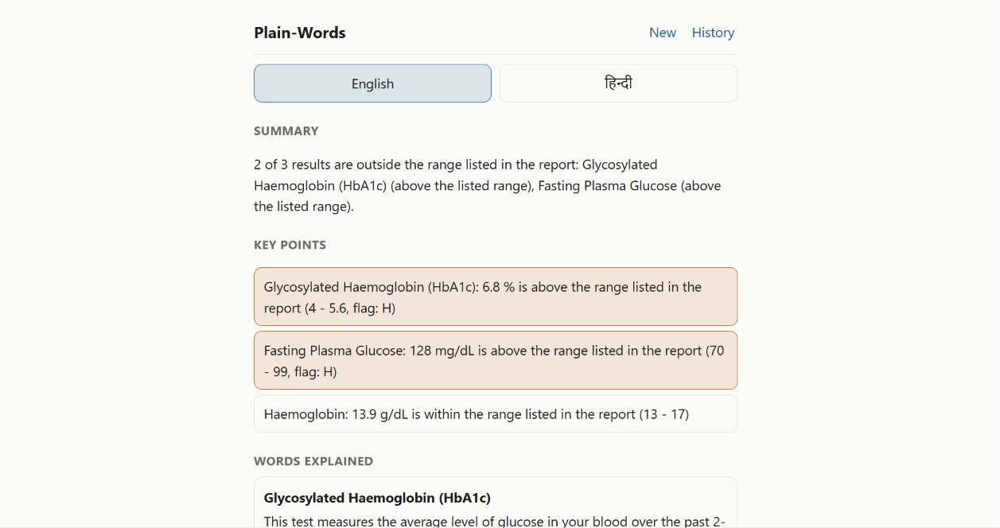
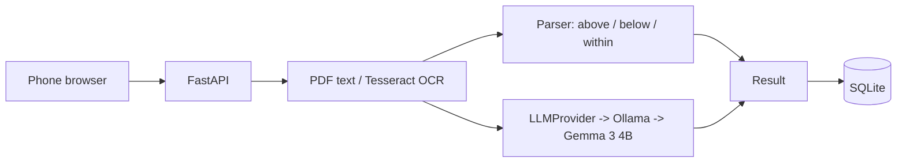

# Plain-Words

A small tool that turns a confusing document (so far: lab reports) into a plain-language explanation in English and Hindi. It runs entirely on a laptop with a local open-weight model. Nothing is sent to the internet.

I built it over a weekend for my college friend Bhavya Gothi, for the Hacktoberfest 2026 DEV "Build for a Friend" challenge. Bhavya's problem, in their words: for medical paperwork they ask the family doctor, and for everything else they upload it to Google and try to understand it, which is very stressful.



## What it does

- Take a photo of a document, upload a PDF or .txt, or paste text.
- Gives a summary, key points, a glossary of the hard words and "things to ask your doctor".
- Switch the result to Hindi.
- Saves a history on your own machine, with a delete button.

## The part I care about most

A 4B model on a CPU should not be trusted to compare numbers. In an early test it said an HbA1c of 6.8% was "within the reference range" on a report that flagged it high, and it failed the same way on repeat runs. So the app doesn't ask it to. Plain code parses each result and its printed reference range and decides above / below / within. The model only writes the glossary. If the document has no numbers (a notice, a form), the model writes the summary.

The glossary meanings are the model's general knowledge, not facts from your document, so they can be wrong or badly translated. Each term's quoted line is checked against the document, which proves the quote exists but not that the meaning is right.

## Stack

React + Vite → FastAPI → explain service → Ollama (`gemma3:4b`) → SQLite. OCR is Tesseract.



All model calls go through one `LLMProvider` interface (`backend/app/llm`). Switching models is a one-line change to `LLM_MODEL` in `.env`.

## The model

- Default: `gemma3:4b` via Ollama, on CPU. It was the better of two I tried at Hindi.
- Qwen 2.5 3B was faster but its Hindi in my test was unusable.
- License: Gemma is released under the **Gemma Terms of Use**, which is Google's own license, not an OSI-approved one. So I call it "open-weight", not "open-source". Read the terms before using it for anything beyond this project.
- My code is MIT. The model keeps its own license.

## Run it (Windows)

Needs Python 3.12, Node, Ollama and Tesseract (with `eng`, optionally `hin`).

```bat
ollama pull gemma3:4b

cd backend
python -m venv .venv
.venv\Scripts\activate
pip install -r requirements.txt
copy .env.example .env
uvicorn app.main:app --host 127.0.0.1 --port 8000
```

In a second terminal:

```bat
cd frontend
npm install
npm run dev
```

Open http://localhost:5173. To use it from a phone, join the same Wi-Fi and open `http://<laptop-ip>:5173`. I only tested on Windows 11.

## Tests

```bat
cd backend
python -m pytest -q
```

10 tests: the range parser, the Hindi templates and the API round trip (with a fake model, so they need no Ollama). Photos, real model output and Hindi quality were checked by hand.

## Limits (honestly)

- CPU only: roughly 35 s to explain and 20 s for Hindi on my i5-13420H, more for photos.
- The range parser handles two line formats. Reports laid out differently get the model-only path, which is less reliable.
- OCR can misread blurry numbers. The app shows the text it read so you can compare it with the paper.
- Tested by one person, on one sample report (fictional data in `samples/`).
- Not medical, legal or financial advice. It explains what a document says. It does not diagnose and does not know your situation.

## Friend testing

> TODO: link or short section once the article is written.

## License

MIT, see [LICENSE](LICENSE). The Gemma model is under the Gemma Terms of Use.